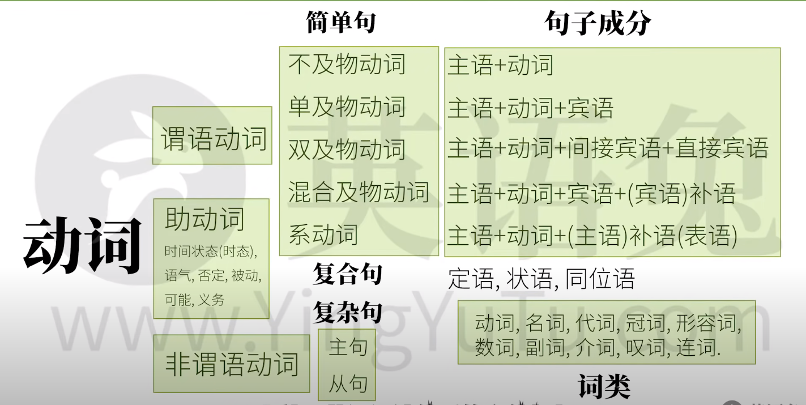

# English syntax structure

## 五种基本句型

1. 可以独立完成的动作：不及物动词
2. 有一个动作的承受者：单及物动词
3. 有两个动作的承受者：双及物动词
4. 只有一个动作承受者：混合及物动词
   - 主语 + 混合及物动词 + 宾语 + 宾语补语
5. 把这个词后面的信息赋予给前者：（连）系动词
   - 赋予
   - 划等号
   - 主语 + 系动词 + 主语补语（表语）

## 句子成分

- 主语
- 谓语
- 宾语
- 主语补语
- 宾语补语
- 定语
- 状语
- 同位语

## 句型

- 复合句（Compound Sentense）
- 复杂句（Complex Sentense）
  - 套娃
  - 主句
  - 从句（修改简单句，作为主句的成分），充当的成分不同，就是不同的从句

## 词类

- 名词 Nouns
- 冠词 Articles
- 代词 Pronouns
- 形容词 Adjectives
- 数词 Numerals
- 副词 Adverbs
- 介词 Prepositions
- 叹词 Interjections
- 连词 Conjunctions
- 动词 Verbs

## 谓语动词的本领

- 表示动作的时间
  - 现在
  - 过去
  - 将来
  - 从过去某个时间算将来
- 表示动作的状态
  - 未说明（一般）
  - 完成
  - 进行
  - 不但完成而且继续（完成进行）
- 表示动作的假设，情感等（语气）

### 助动词(auxiliary verb)

协助动词施展上述本领

- have
- be
- can
- might
- must
- do

## 非谓语动词

动词还有可能充当句子中的其他成分，只不过需要修改谓语动词，改为非谓语动词，非谓语动词几乎可以取代所有的从句，但是非谓语动词丧失了“时态气”

- 动词不定式
- 现在分词
- 动名词
- 过去分词

## overview

